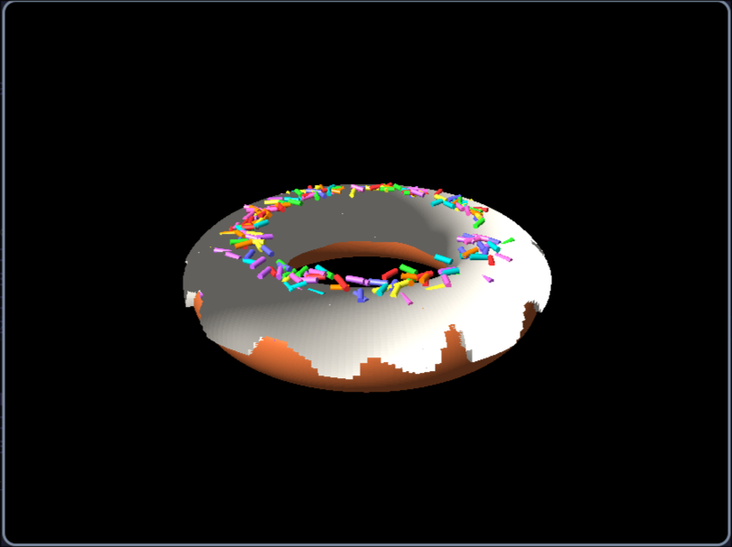
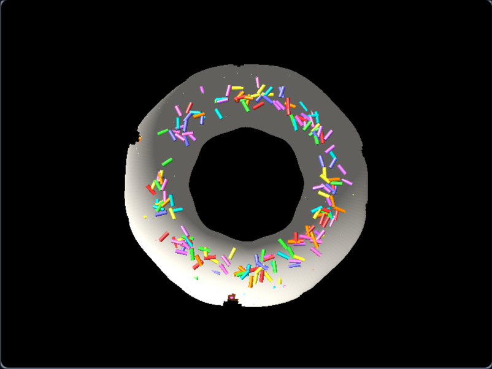

# OpenGL Donut

## Giới thiệu

OpenGL Donut là một chương trình hiển thị mô phỏng hình donut 3D quay bằng OpenGL. Chương trình sử dụng các kỹ thuật đồ họa máy tính để hiển thị một mô hình với hiệu ứng ánh sáng và xoay động.

## Demo

	
	

## Yêu cầu hệ thống

...

# OpenGL Donut

## Giới thiệu

OpenGL Donut là một chương trình hiển thị mô phỏng hình donut 3D quay bằng OpenGL. Chương trình sử dụng các kỹ thuật đồ họa máy tính để hiển thị một mô hình với hiệu ứng ánh sáng và xoay động.

## Yêu cầu hệ thống

- Hệ điều hành: Windows / Linux / macOS
- Trình biên dịch hỗ trợ C++
- OpenGL (GLUT hoặc GLFW)
- Thư viện hỗ trợ: `GL`, `GLU`, `GLUT` hoặc `GLFW`

## Tính năng nổi bật

- Hiển thị mô hình 3D với OpenGL
- Điều chỉnh tốc độ quay
- Hỗ trợ nhiều nền tảng

## Đóng góp

Nếu bạn muốn cải thiện dự án, hãy tạo pull request hoặc báo lỗi tại GitHub!
